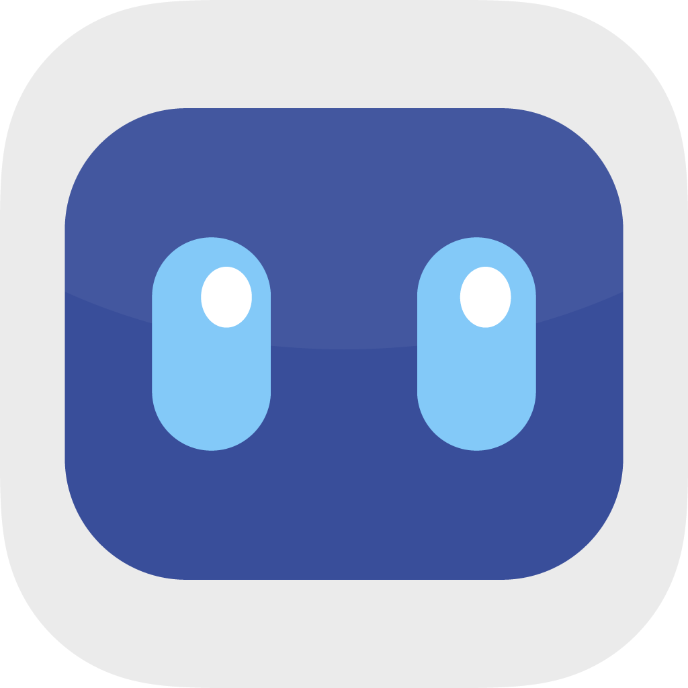
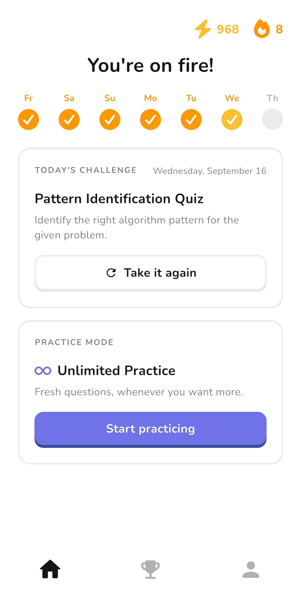
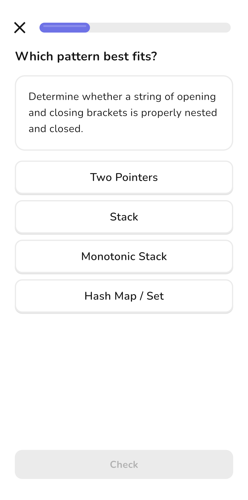
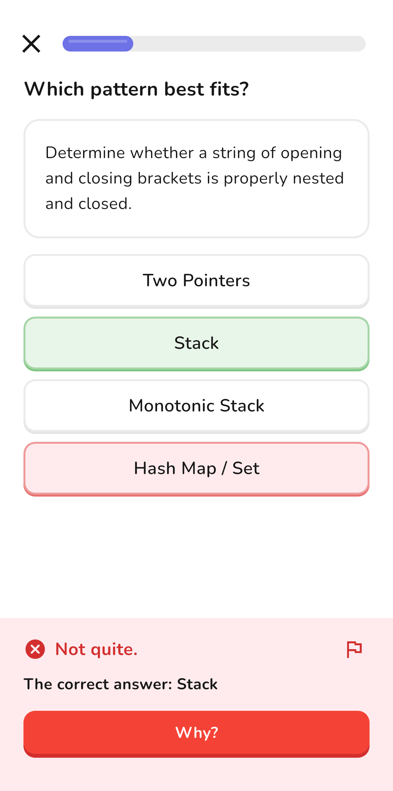
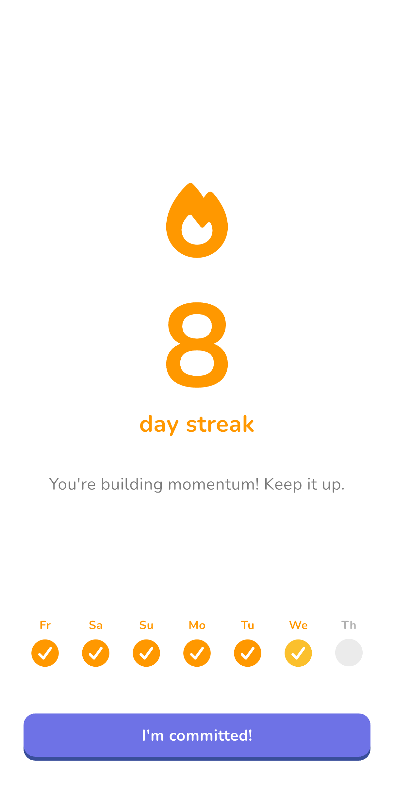
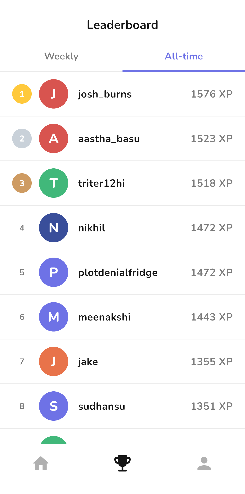

  

# AlgoPattern

**Learn to recognize the patterns behind coding interview problems.**

  
  &nbsp;&nbsp;
  

## What AlgoPattern does

Coding interview problems often look very different on the surface while relying on the same underlying solution patterns.

Most practice resources organize problems by pattern. That is useful for implementation practice, but it removes an important part of the interview itself: recognizing which pattern applies before anyone tells you the category.

AlgoPattern focuses on that recognition step.

Users work through short exercises that present a coding problem and ask them to identify the underlying approach before writing code. Feedback explains why a pattern fits, and the app builds the habit through repeated daily practice.

Around that core are progress systems including streaks, XP, profiles, leaderboards, reminders, and additional practice for Pro users.

## Screens

  
  
  
  
  

  Daily practice · pattern recognition · feedback · streaks · leaderboards

## Built for production

AlgoPattern began as a prototype and has since gone through closed beta, public launch, and continued production development across both major mobile platforms.

The current product includes:

* daily pattern-recognition quizzes;
* explanations and follow-up practice;
* XP and streak tracking;
* unlimited practice for Pro users;
* profiles and usernames;
* weekly and all-time leaderboards;
* reminder scheduling;
* authentication across multiple providers;
* subscriptions and entitlement management;
* product analytics and error monitoring.

The app is actively maintained and has been used by hundreds of learners across more than ten thousand answered practice questions.

## Technology

| Area              | Technology                |
| ----------------- | ------------------------- |
| Mobile            | Flutter / Dart            |
| Backend           | Supabase                  |
| Product analytics | PostHog                   |
| Subscriptions     | RevenueCat                |
| Web               | Next.js                   |
| CI / releases     | GitHub Actions / Fastlane |
| Platforms         | iOS / Android             |

The production system also includes the supporting infrastructure required for authentication, notifications, content delivery, testing, monitoring, and mobile distribution.

## Engineering scope

Building and operating AlgoPattern has involved significantly more than implementing quiz screens.

### Cross-platform product engineering

The application is developed from a shared Flutter codebase and shipped as a production product on both iOS and Android.

Development has included responsive mobile UI, accessibility, platform-specific integrations, authentication, notifications, subscriptions, state management, and support for multiple app lifecycle and network conditions.

### Reliable user progress

Systems such as XP, streaks, quiz completion, profiles, and user progress need to remain consistent even when requests are retried, connectivity is poor, or a user returns on another device.

Several parts of the product have been redesigned over time as real production behavior exposed edge cases that were not visible during initial development.

### Mobile networking

Learning interactions are designed so that unreliable connectivity does not unnecessarily interrupt a quiz.

The app distinguishes between operations the user must wait for and background work that can happen independently, while giving meaningful recovery states when network access is actually required.

### Authentication and identity

AlgoPattern supports low-friction onboarding alongside authenticated accounts using Apple, Google, and email.

The product has to preserve user progress through account transitions while also handling the platform-specific behavior and edge cases that come with real mobile authentication systems.

### Social features

Profiles, usernames, and leaderboards added a new set of privacy, identity, and data-access concerns to a product that had previously been almost entirely single-user.

These features were designed so that the information intentionally made social remains separate from private account data.

### Production releases

Changes go through automated formatting, analysis, and testing before release.

The release process is automated across both App Store Connect and Google Play, reducing the amount of repetitive work required to ship frequent product updates while still keeping a human review step before publication.

## Product development

AlgoPattern is developed iteratively rather than from a fixed specification.

Usage analytics, bug reports, explanation feedback, app-store feedback, and direct user feedback all influence what gets built next.

That has led to changes across areas such as:

* quiz length and pacing;
* onboarding;
* feedback after wrong answers;
* notification UX;
* reliability under weak network conditions;
* social features;
* subscription UX;
* accessibility;
* progression and motivation systems.

The goal is to keep the engineering closely connected to how people actually use the product.

## Evolution

| Period             | Milestone                                                                             |
| ------------------ | ------------------------------------------------------------------------------------- |
| **2025**           | Early interaction and learning prototypes                                             |
| **June 2026**      | First beta builds in testers' hands                                                   |
| **July 2026**      | Reliability, onboarding, authentication, and UX iteration                             |
| **August 2026**    | Public v1 launch on iOS and Android                                                   |
| **September 2026** | v2 introduced profiles, usernames, leaderboards, and additional learning interactions |
| **Today**          | Actively developed and iterated in production                                         |

## Source availability

AlgoPattern is a commercial product, so the production application source code, backend implementation, and learning-content repository are private.

This repository is intentionally limited to a public overview of the shipped product and the scope of the engineering work behind it.

## Built by

**[Anna Stefaniv Oickle](https://github.com/anna-st-40)** - founder and developer of AlgoPattern.
